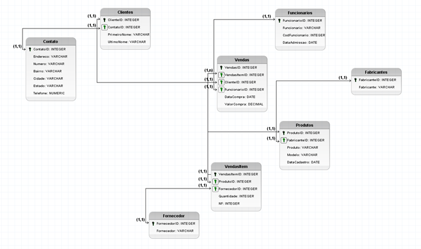
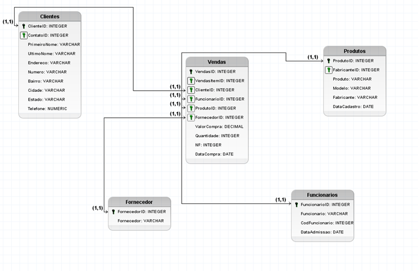

# O que é modelagem dimensional?

​​​​​​​Modelos dimensionais são estruturas  **desnormalizadas** projetadas para consultas otimizadas dos dados. Para exemplificar, em um banco de dados criado para uma determinada aplicação temos o modelo Entidade-Relacionamento (modelos ER). Esses modelos são criados visando operações de  **INSERT**,  **DELETE** e  **UPDATE** dos dados. Já em um modelo dimensional o principal foco é a operação de  **SELECT** dos dados.

A modelagem dimensional mescla as tabelas no próprio modelo, o que permite que os usuários recuperem dados mais rapidamente de diferentes fontes executando consultas de junção. Como resultado, ele complementa muito os objetivos de Analytics de uma organização.

Para exemplificar, imagine um banco de dados para um aplicativo que controla vendas de uma loja de música, em que temos o seguinte cenário:

Esse modelo de Entidade-Relacionamento é criado como citado para otimizar as operações de  **INSERT**,  **DELETE** e  **UPDATE**. Sendo assim, caso necessário incluir em um aplicativo na tela de cadastro um novo funcionário ou cliente, essa tarefa seria simplificada pois precisaríamos nos preocupar apenas com uma tabela no modelo.

Porém, para efetuar um  **SELECT** trazendo todos os dados de faixa, álbum, gênero e artista, precisaríamos de diversos comandos  **JOIN** para fazê-lo.​​​​​​​

Um modelo dimensional, por ser  **desnormalizado**, teria a seguinte construção para o cenário apresentado:

Dessa forma para fazer um  **SELECT** nesse modelo seria mais simples e performático por ter menos ligações.​​​​​​​

Então a solução seria apenas fazer uma junção das tabelas?

A resposta é não. Existem elementos e regras para a criação de um modelo dimensional que explicaremos a fundo nos próximos tópicos.

## Elementos de um modelo de dados dimensional

Vamos utilizar como exemplo de modelagem dimensional neste momento o **Star Schema**.

A primeira coisa que precisamos saber em um modelo dimensional é identificar nos nossos dados o que é  **fato** e o que é  **dimensão**.

### **Tabela Fato**

São tabelas em que os atributos têm características  **quantitativas**.

Isso significa que são tabelas onde os atributos têm as métricas que vamos executar operações matemáticas. Por exemplo, a quantidade de itens de um pedido ou o valor das vendas realizadas.

Na tabela fato colocamos apenas as chaves para ligar nas outras tabelas do modelo e alguns campos referenciais que identificam a fato.

E quais seriam essas outras tabelas que ligam na fato? 

### **Tabelas Dimensão**

São tabelas em que os atributos têm características  **qualitativas**.

Para facilitar, na tabela fato nós colocamos a quantidade das vendas, já nas dimensões temos que informar quem comprou, o que comprou e quando comprou. Isso significa que vamos colocar as **“qualidades”** da fato.

No modelo dimensional essas tabelas de dimensão são geralmente ligadas diretamente na tabela fato. Essas ligações diretas na fato otimizam as consultas e a navegação entre os dados.

Quando temos esse modelo onde ligamos as dimensões diretamente na fato, chamamos esse relacionamento de  **Star Schema**, e será abordado com mais detalhes no próximo módulo.

Eventualmente, pode ser utilizado o modelo **Snowflake Schema**, que também é um modelo dimensional, porém não é o mais indicado, devido à problemas de performance e conflitos nas consultas dos dados. Iremos detalhar mais sobre esse modelo nas próximas páginas.

## Projetando um modelo de dados dimensionais

Para desenvolver o modelo dimensional, precisamos desenvolver 4 etapas de decisão:

-   Definição dos processos de negócio;
-   Declaração (ou definição) da granularidade;
-   Identificação das tabelas dimensão;​​​​​​​
-   Identificação das tabelas fato.

Para entender melhor cada uma dessas etapas, iremos detalhar mais na página seguinte.