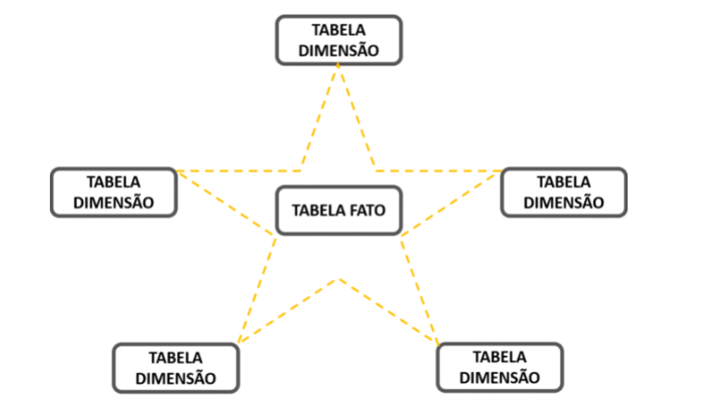
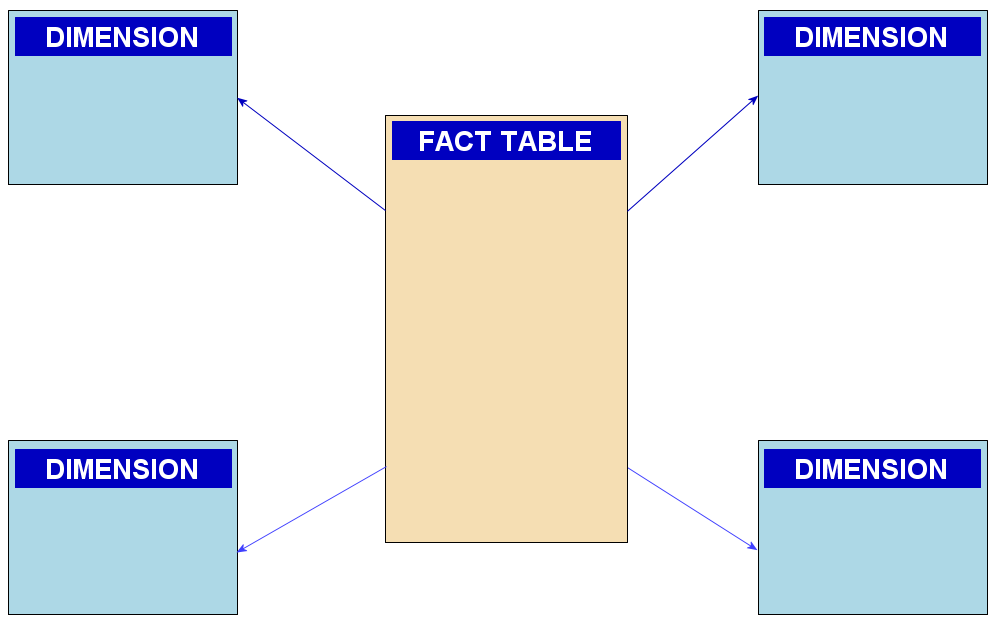

# Star Schema

No **Star Schema**, a tabela fato é centralizada e as tabelas dimensões ligam-se diretamente dando a aparência de uma estrela:

Este é o modelo de dados mais difundido para projetos de Analytics. Esse modelo foi desenhado por  **Ralph Kimball**,  com o objetivo de simplificar a visualização dimensional, facilitando a distinção entre dimensões e fatos.

Para melhor explicar o que é **fato**, **dimensão** e **granularidade**, vamos ver cada dos 4 passos para a modelagem da metodologia Star Schema:

1. **Escolha os processos de negócio:** Os processos de negócios são as atividades operacionais executadas por sua organização, como fazer um pedido, processar uma reclamação ou registrar alunos em uma aula. Os eventos de processos de negócios geram ou capturam métricas de desempenho que se traduzem em fatos em uma tabela de fatos. A maioria das tabelas de fatos concentra-se nos resultados de um único processo de negócio. A escolha do processo é importante porque define um objetivo específico do projeto e permite que o grão, as dimensões e os fatos sejam declarados. Em resumo, defina se você vai acompanhar as vendas, matrículas, cadastros ou qualquer métrica de desempenho que será traduzida em fato.

2. **Declare a granularidade (ou o grão):** Declarar o grão é a etapa fundamental em um projeto dimensional. O grão estabelece exatamente o que uma única linha da tabela de fatos representa. O grão deve ser declarado antes de escolher dimensões ou fatos porque cada dimensão ou fato candidato deve ser consistente com o grão. Essa consistência impõe uniformidade em todos os projetos dimensionais que são essenciais para o desempenho e facilidade de uso do aplicativo de BI. O grão atômico refere-se ao nível mais baixo no qual os dados são capturados por um determinado processo de negócios. Cada grão da tabela de fatos proposta resulta em uma tabela física separada; grãos diferentes não devem ser misturados na mesma tabela de fatos. Se quiser entender mais sobre como definir a granularidade do seu modelo, esse  [link](https://docs.oracle.com/middleware/bidvhelp/desktop/pt_BR/BIDVD/GUID-7B673270-268A-4D70-8E13-0FBA0873A993.htm#BIDVD-GUID-7B673270-268A-4D70-8E13-0FBA0873A993 )  pode te ajudar.

3. **Identifique as dimensões:** As dimensões fornecem o contexto “quem, o quê, onde, quando, por que e como” em torno de um evento de processo de negócios. As tabelas de dimensão contêm os atributos descritivos usados pelos aplicativos de BI para filtrar e agrupar os fatos. Com o grão de uma tabela de fatos em mente, todas as dimensões possíveis podem ser identificadas. Sempre que possível, uma dimensão deve ter um valor único quando associada a uma determinada linha de fato. As tabelas de dimensão às vezes são chamadas de “alma” do data warehouse porque contêm os pontos de entrada e rótulos descritivos que permitem que o sistema Data Warehouse / BI seja aproveitado para análise de negócios.

4. **Identifique os fatos:** Fatos são as medidas que resultam de um evento de processo de negócios e quase sempre são numéricos. Uma única linha da tabela de fatos tem um relacionamento de um para um com um evento de medição, conforme descrito pela granulação da tabela de fatos. Assim, uma tabela de fatos corresponde a um evento físico observável, e não às demandas de um relatório específico. Em uma tabela de fatos, apenas fatos consistentes com o grão declarado são permitidos. Por exemplo, em uma transação de vendas no varejo, a quantidade de um produto vendido e seu preço estendido são bons fatos, enquanto o salário do gerente da loja não é permitido. Em resumo, o FATO é o ocorrido (como o número de vendas de um produto) ligado às suas dimensões que permitem uma análise mais detalhada.

## Visualização de dados

A modelagem na metodologia Star Schema também é muito importante para ferramentas de Data Visualization como Power BI, Qlik e Tableau, pois as tabelas de dimensões geralmente são compatíveis com filtros e agrupamentos, enquanto a tabela de fatos é compatível com resumo.

Apenas um ponto importante. Não é só porque chama-se star schema que deve ter apenas 5 dimensões no modelo. Pode-se ter quantas dimensões forem necessárias.

Caso o conceito de Star Schema não tenha ficado claro, visite esse  [vídeo do YouTube](https://youtu.be/6VaX68aAztg). Nele contém algumas explicações interessantes para complementar o tema.

Agora, vamos utilizar esses conceitos e aplicá-los em um exemplo na página seguinte.