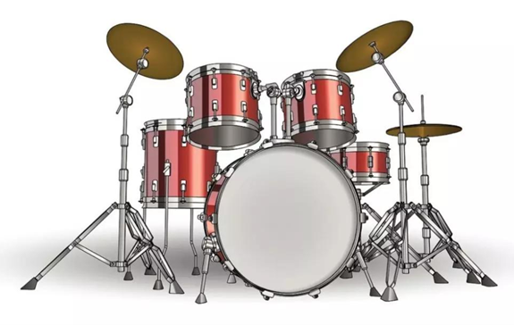
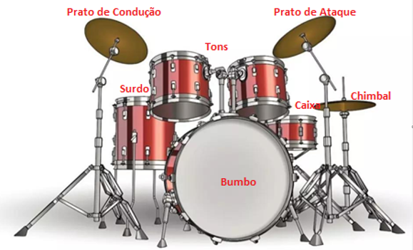
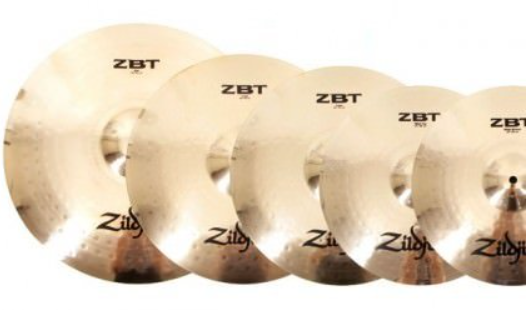
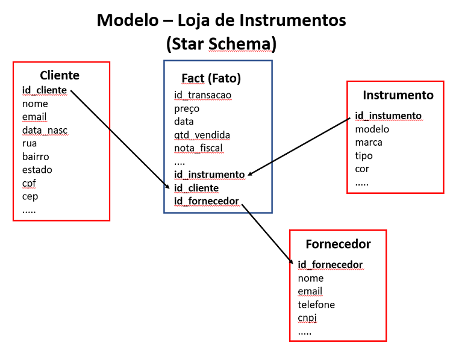

# Exemplo de um Star Schema

 Temos uma loja que vende instrumentos musicais. Sendo assim, precisamos entender o conceito dos dados. O que será vendido? Quais os instrumentos musicais que têm na loja? Resumindo, quais as informações que são importantes para o negócio:

1. **Declaração / Definição da Granularidade**:

    Após entender o que é esperado para o negócio, é necessário identificar nos dados a granularidade das informações.

    Granularidade se refere ao nível em que os dados serão armazenados no modelo. Por exemplo:​​​​​​​

    **A.** Posso ter um item bateria na minha loja:

    

    **B.** Ou, posso dividir os itens pelas partes de uma bateria:

    

    **C.** Ou então, o tamanho de cada elemento da bateria:

    - Prato de Ataque de 21”
    - Prato de Ataque de 19”
    - Prato de Ataque de 14”

    

2. **Identificação das Fatos:** ​​​​​​​Como explicado anteriormente a fato é a tabela que guarda as informações com atributos quantitativos. Nessa parte do processo temos que identificar então a tabela que contêm as vendas realizadas, o preço dos instrumentos e a quantidade vendida.

3. **Identificação das Dimensões:** Depois de identificar a fato e os atributos quantitativos, chega a hora de identificar todas as tabelas de dimensões e quais os atributos qualitativos serão levados para o modelo. Podemos por exemplo ter uma tabela de instrumentos musicais, outra de fornecedores, outra de clientes, entre outras.

Segue abaixo um exemplo de modelo **Star Schema** para a loja de instrumentos:

Com isso, podemos entender mais claramente a separação dos elementos de cada parte. Na próxima página, iremos ver como funciona o modelo **Snowflake Schema**, um outro tipo de modelo dimensional que é parecido com o **Star Schema**, porém com algumas diferenças relevantes em seu funcionamento.
