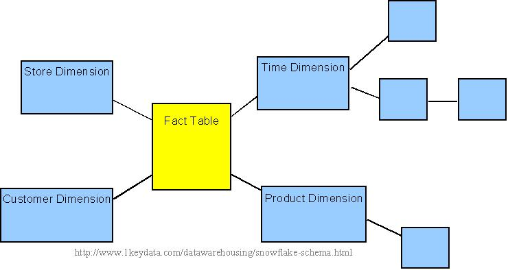
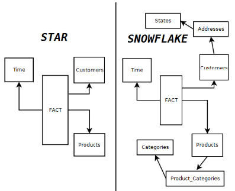
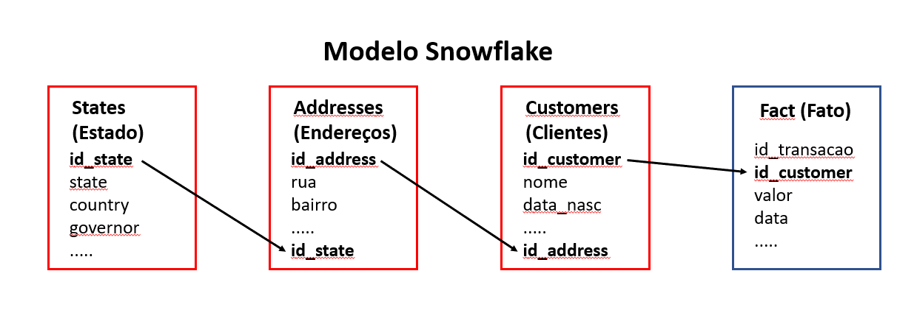
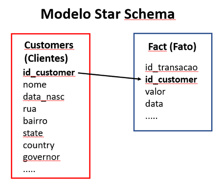

# O que é o modelo Snowflake?

O modelo de dados **Snowflake** é uma estrutura lógica de dados que facilita a análise de dados complexos. O modelo possui esse nome porque se parece visualmente com um floco de neve, devido ao relacionamento entre os dados.

Nesse modelo, várias tabelas dimensão se relacionam com uma tabela fato, de modo que os dados das tabelas dimensão são conectados em um formato de cascata (hierarquia) e, portanto, algumas tabelas dimensão ficarão mais distantes da tabela fato.

## Diferenças entre o modelo Snowflake e o modelo Star Schema

Conforme podemos ver na figura acima, no modelo **Star Schema** não existe conexão alguma entre as tabelas dimensão (se voce já está craque, saberá quais são: "Time", "Customers" e "Products"!). Todas elas são conectadas diretamente à tabela fato, sem interdependências; todas as tabelas já possuem os devidos dados necessários para complementar as informções apresentadas na tabela fato.

Já no modelo **Snowflake**, é possível notar que nem todas as tabelas dimensão estão conectadas diretamente à fato; Por exemplo, temos conectada diretamente à fato a tabela "Customers", que, por sua vez, possui conexão direta com a "Addresses" e, por fim, esta possui conexão com a "States". É possível consultar as informações dessas tabelas a partir da tabela fato? Sim, porém por muitas vezes serão necessárias consultas mais complexas, que abrangam o conteúdo de todas as tabelas a serem consultadas. Será necessário fazer no mínimo 3 junções entre tabelas, caso você queira apresentar as informações, por exemplo, da tabela fato e da tabela "States" ao mesmo tempo. Essa complexidade das consultas também impacta diretamente na performance do modelo, tornando-o mais lento e exigindo mais capacidade de processamento. Como podemos ver na figura, se este fosse estabelecido por meio do **Star Schema**, somente haveria a necessidade de efetuar apenas uma única junção entre a fato e a dimensão, portanto tornando a consulta menos complexa e mais performática.

A manutenção dos dados também é mais simples no modelo **Star Schema**. Caso seja necessário atualizar uma informação de uma dimensão, basta efetuá-la em apenas uma tabela, não sendo necessário verificar demais tabelas para tornar os dados consistentes entre si. No modelo **Snowflake**, é necessário garantir que o dado esteja correto em todos os níveis hierárquicos e, caso necessário, efetuar as devidas atualizações em cada uma das tabelas dimensão.

Então, como podemos transformar um modelo **Snowflake** para um modelo **Star Schema**? Utilizando ainda o exemplo da figura, no modelo **Snowflake** temos 3 tabelas que apresentam todas as informações de um cliente: "Customers" (Clientes), "Addressses" (Endereços) e "States" (Estados). Ao invés de utilizarmos essas 3 tabelas para um único tipo de informação, podemos juntar as informações de todas as 3 tabelas em uma única tabela: "Customers" (Clientes). Podemos reunir todas as informações necessárias nesta tabela, alocando as informações de "Endereço" e "Estados" diretamente nesta, sem alocarmos em tabelas separadas. Segue o exemplo, mais detalhado:

Percebe que as tabelas dimensões, que tratam de um mesmo tipo de dado, estão interdependentes? Agora, vamos reunir os dados das tabelas dimensão do exemplo em uma única tabela, "Customers":

Reunimos agora, então, todos os dados que tratam sobre clientes em uma única tabela. Desta forma, as consultas entre a fato e os dados da dimensão exigirão menor processamento (e serão efetuadas de forma mais rápida, também!), e serão menos verbosas e complexas.

Resumindo:

1. O modelo **Star Schema** é um tipo de esquema multidimensional em que os dados são armazenados em uma tabela central, chamada de tabela “fato”, e várias tabelas auxiliares, chamadas de tabelas "dimensão". O modelo **Snowflake** é um tipo de modelo multidimensional em que os dados são armazenados em várias tabelas, cada uma representando uma dimensão.

2. O número de junções necessárias em uma consulta, no modelo **Star Schema** será menor do que no modelo **Snowflake**, pois os dados estão armazenados em apenas dois níveis hierárquicos. No modelo **Snowflake**, o número de junções necessárias pode ser maior, pois os dados estão divididos em vários níveis hierárquicos.

3. O desempenho das consultas é geralmente melhor no caso do **Star Schema**, devido ao fato de serem necessárias menos junções entre as tabelas fato e dimensão.

4. A manutenção dos dados é geralmente mais simples no caso do **Star Schema**, pois há apenas duas tabelas envolvidas para cada dimensão. Já na manutenção dos dados do modelo **Snowflake**, pode ser necessário atualizar várias tabelas separadamente. Pelo fato do modelo **Star Schema** apresentar dados com menos níveis hierarquicamente, normalmente a manutenção dessas tabelas é mais simples.
